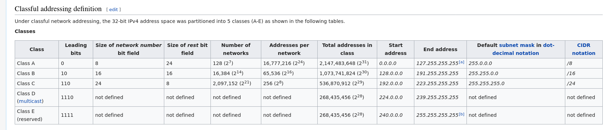

# Cisco Networking Academy
Notes for the exam of PST course. Document contains useful commands for the routing configuration and it is structured for the fast search of commands.

## Common Masks
* 255.255.0.0 = 16
* 255.255.252.0 = 22
* 255.255.255.0 = 24
* 255.255.255.252 = 30
* 255.255.255.255 = 32

## IP classes
Sometimes we don't need to specify the masks as they are specified by the class by default. (Therefore sometimes there are no masks in the commands.)


## Common commands

* configuration mode `conf t`
* router ip address
```bash
# f0/0 or loop as interface
int loop0
# ip address and mask
ip addr 192.168.1.1 255.255.255.252 
# enable the interface
no shutdown
```
* show routing tables
```bash
show ip route
```

## BGP

* set up bgp routing
```bash
# enable routing bgp for router with `AS 100`
router bgp 100
# add neighbor on IP with `AS 300`
neighbor 192.168.1.6 remote-as 300
# set Loop IP on current machine
network 201.0.0.0
``` 
* show bgp neighbors
```bash
show ip bgp neighbors
```
* show bgp routing tables
```bash
show ip bgp
```
* remove private AS numbers from AS_Path configuration from Customer -> middle router striping from all other routers
```bash
# on middle router
router bgp 300
# IP of all other routers except the customer
neighbor 192.168.1.5 remove-private-as
```
* clear BGP records
```bash
clear ip bgp *
``` 
* BGP access list filtering - setup a list
```bash
# 1 - id of the list
# ^100$ regex, that it both begins and eds with number 100 -> only AS 100
ip as-path access-list 1 deny ^100$
# permit other ones
ip as-path access-list 1 permit .*
```
* apply the list on router
```bash
# select correct bgp
router bgp 300 
# apply the filter list 1 on all routing info sent to the provided neighbor
neighbor 172.24.1.18 filter-list 1 out
```
* access list - advertising only some networks
```bash
# create access list 1 and permit all connections only on networks 192.168.1.0 and 192.168.0.0
access-list 1 permit 192.168.0.0 0.0.1.255
```
* apply access list as router filter 
```bash
# on the main node
router bgp 100
# all outgoing bgp requests to neighbor 10.0.0.1 are filtered according the list 1
neighbor 10.0.0.1 distribute-list 1 out
```
## RIPv2
Distance vector routing protocol - hop counts as routing metric. Implements limit on hops.
In most networking environments, RIP is not the preferred choice for routing as its time to converge and scalability are poor compared to EIGRP, OSPF, or IS-IS. However, it is easy to configure, because RIP does not require any parameters, unlike other protocols.
RIP uses the User Datagram Protocol (UDP) as its transport protocol, and is assigned the reserved port number 520. [source: Wiki](https://en.wikipedia.org/wiki/Routing_Information_Protocol)

